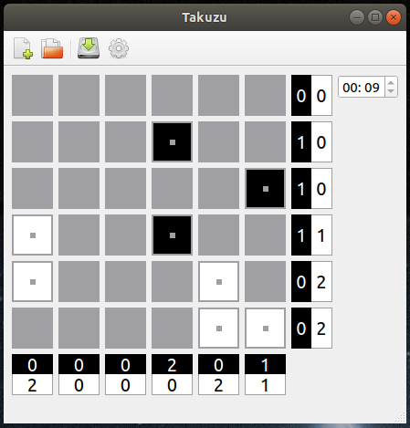
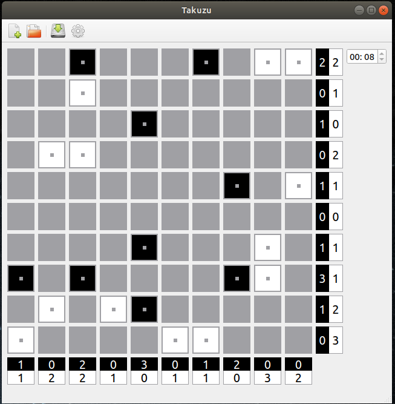
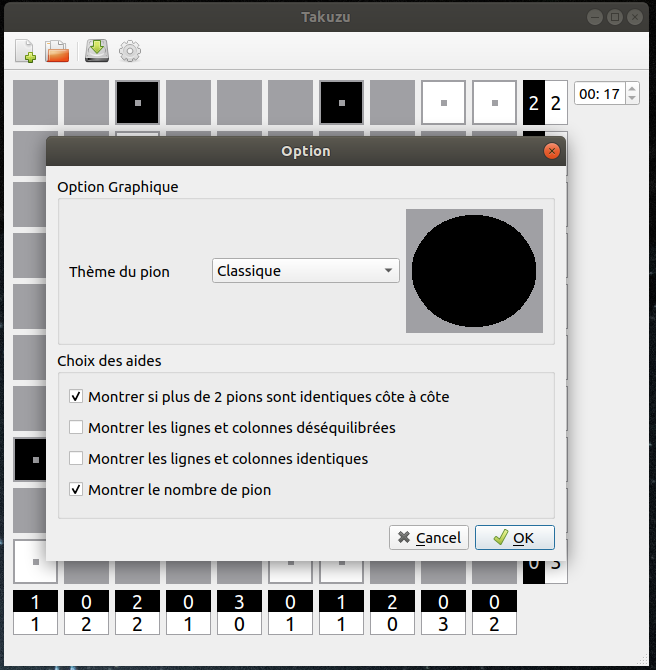
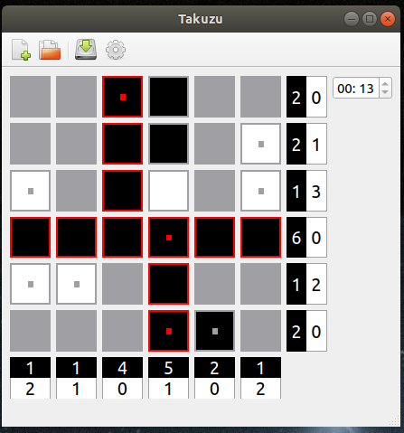

# Rapport project Takuzu

+ Cédric Dezobry
+ Thibault Laroumagne

Projet réalisé avec QtCreator 5.14.1 pour le cours d'interface graphique

## Fonctionnalitées implémentées parmi celles suggérées :
+ Choix de la taille et du niveau de difficulté
+ Chronomètre indiquant le temps de jeu
+ Mise en évidence des erreurs
+ Indication chiffrée du nombre de cases de chaque couleur sur chaque ligne/colonne
+ Personnalisation de l'affichage des états des cases
+ Choix libre parmi les aides visuelles

## Capture d'écran

## Les particularités "innovantes"
+ Plusieurs design de pion disponibles.
+ Visualisation du changement de design du pion dans la fenêtre des options
+ Le chronomètre est arrété lors de l'ouverture de popup
+ Lors du chargement d'une grile sauvegardée, le chronomètre est remis a jour

## La répartition du travail au sein du binome

Cédric:

+ gestion du Git
+ mise en place des patrons de conception
+ test unitaire pour le modèle

Thibault:

+ mise en place de la lecture des grilles
+ Chargement/Sauvegarde des grilles
+ Création des popups (sauf option)

## Les choix effectués concernant l'ergonomie
+ Raccourcis clavier pour la barre des menu
+ Traduction francaise et anglaise
+ La fenêtre de jeu est redimensionable
+ le chronométre est sauvegardé avec sa grille pour être rechargé
+ Les aides de jeu sont affichées dans la barre de status

Particularités pour Linux:

+ Utilisation d'icone du théme
 
## Les choix de modélisation:
- Utilisation du patron d'architecture MVP
- Utilisation du patrons Etat pour les différents design du pion
- Utilisation du patron Observateur pour les cellules indiquant le nombre de pions
- Utilisation massive des signaux:
    + le modèle envoie des signaux si des rêgles ne sont respectées
    + chaque popup transmet les signaux de ces composants importants
    + chaque pion envoit un signal au modèle lorsqu'il est cliqué. 

## Remarque utile
Le patron observateur ne demande pas de pouvoir supprimer les observateur.
